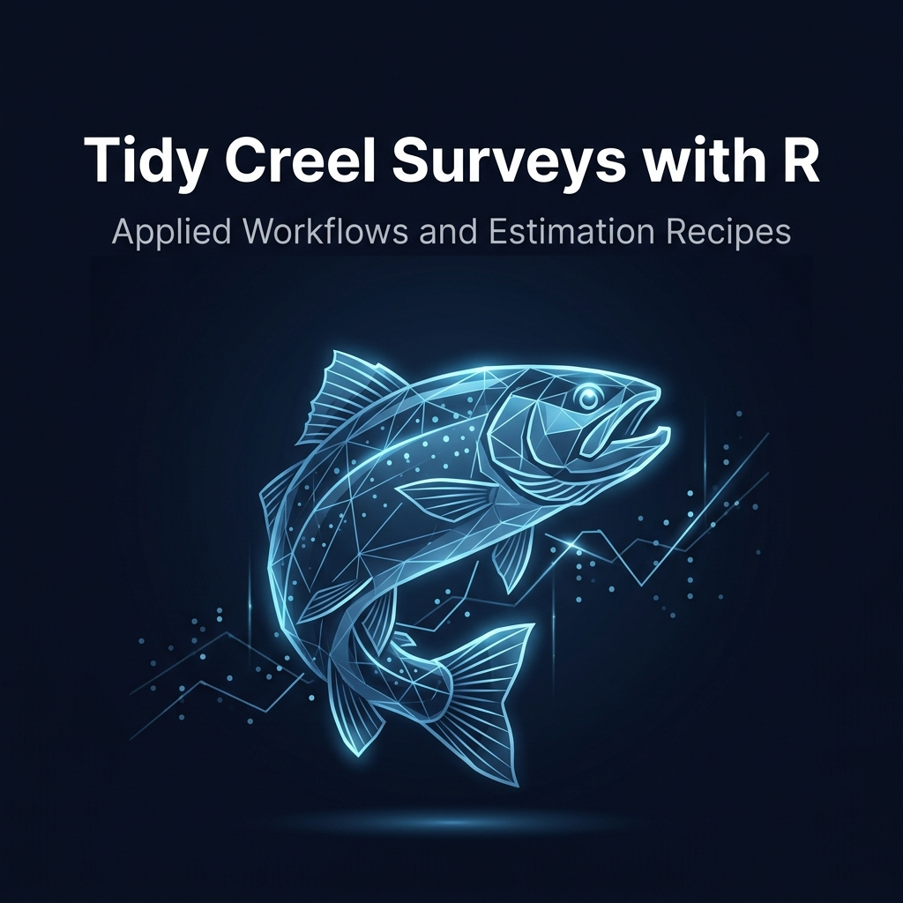

# Modern Creel Survey Analysis in R

**Design, estimation, diagnostics, and reporting with `tidycreel`**

*Modern Creel Survey Analysis in R* guides readers through contemporary approaches to creel survey analysis using R. The book is a companion to [`tidycreel`](https://chrischizinski.github.io/tidycreel/), but it is broader than a package manual. Rather than documenting functions one at a time, it focuses on the practical and statistical reasoning needed to move from creel survey data to defensible estimates.

## What this book covers

Creel surveys occupy a challenging space between field logistics, survey design, data management, statistical estimation, and management reporting. This book treats real-world complications — changing access patterns, incomplete interviews, variable trip lengths, stratified sampling designs, nonresponse — as part of the analysis, not as distractions from it.

Estimation is framed around a simple question: *what quantity are we trying to estimate, for what population, over what domain, and under what sampling design?*

Topics include:

- Survey design: access-point, roving, aerial, and camera-assisted surveys
- Stratification and allocation strategies
- Bias, failure modes, and diagnostics
- Data structure: creel data as linked relational tables
- Effort, catch, harvest, CPUE, and release estimation
- Uncertainty quantification and precision reporting
- Interpretation and management reporting
- Multi-year monitoring and trend detection
- Case studies using Harlan Reservoir data

## Who this is for

Analysts, managers, students, and reviewers who need to understand how creel estimates are produced and how they should be interpreted. Especially aimed at readers connecting field data to defensible estimates of angler effort, catch, harvest, trip characteristics, and catch rates.

## Built with

- [Quarto](https://quarto.org/) book format
- [`tidycreel`](https://chrischizinski.github.io/tidycreel/) R package
- `tidyverse` (dplyr, tidyr, ggplot2, purrr)

## License

[Creative Commons Attribution 4.0 International](http://creativecommons.org/licenses/by/4.0/)

Chizinski, C. 2026. *Modern Creel Survey Analysis in R: Design, Estimation, Diagnostics, and Reporting with tidycreel*.
